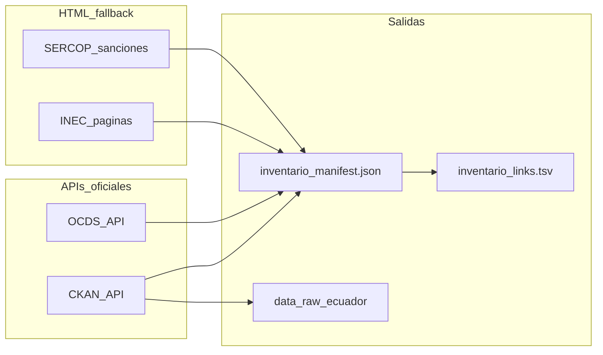

# Inventario de fuentes Ecuador para siniestros

Documento operativo para el reto **Aseguradora del Sur** (hackIAthon 2026).  
Bloque inicial confirmado: **CKAN + INEC + SERCOP/OCDS**.

> No existen en Ecuador bases abiertas con siniestros de seguros por placa/asegurado. Las fuentes listadas sirven para **contexto**, **enriquecimiento** y **lista restrictiva de proveedores**; el núcleo de reclamos debe ser **sintético** o dataset internacional (Kaggle/Mendeley).

---

## 1. Resumen por bloque

| Bloque | Uso en RastroSeguro | Método preferido | Periodo sugerido |
|--------|---------------------|------------------|------------------|
| CKAN / ECU911 | Incidentes tipo accidente/emergencia, geo y fecha | API CKAN + descarga CSV | 2021–2026 |
| CKAN / ANT | Comportamiento transporte, excesos velocidad | API `package_search` | 2020–2026 |
| INEC / ESTRA | Priors agregados (siniestros, lesionados, causas) | Enlaces PDF/CSV en HTML | 2014–2026 |
| SERCOP sanciones | Lista restrictiva proveedores (RUC) | Scraping tabla HTML | 2020–2026 |
| OCDS | Historial contratación pública proveedor | API `search_ocds` | 2020–2026 |

---

## 2. Datos Abiertos Ecuador (CKAN)

| Recurso | URL | Campos útiles | Tabla destino |
|---------|-----|---------------|---------------|
| Catálogo | https://datosabiertos.gob.ec/ | — | — |
| API CKAN | https://datosabiertos.gob.ec/api/3 | metadatos, `resources[].url` | — |
| ECU911 emergencias | https://www.datosabiertos.gob.ec/dataset/base-de-emergencias | fecha, tipo, provincia, cantón | `siniestros` (proxy evento) |
| ANT (org) | https://datosabiertos.gob.ec/dataset/?organization=antec | velocidad, ruta, kit | `vehiculos` |
| Transporte CSV | https://www.datosabiertos.gob.ec/dataset/?res_format=CSV&groups=trans | varios | — |
| SRI vehículos 2024 | https://www.datosabiertos.gob.ec/dataset/estadisticas-vehiculos-2024 | marca, modelo, año, cantón | `vehiculos` |

**API ejemplo (metadatos ECU911):**

```http
GET https://www.datosabiertos.gob.ec/api/3/action/package_show?id=base-de-emergencias
```

**API ejemplo (datasets ANT):**

```http
GET https://www.datosabiertos.gob.ec/api/3/action/package_search?fq=organization:antec&rows=100
```

---

## 3. INEC — Estadísticas de siniestros de tránsito

Fuente administrativa: **ANT**. Publicación agregada (no microdatos por placa).

| Recurso | URL | Formato | Uso |
|---------|-----|---------|-----|
| Anual | https://www.ecuadorencifras.gob.ec/estadisticas-siniestros-de-transito/ | tablas + PDF | tendencias nacionales |
| Trimestral | https://www.ecuadorencifras.gob.ec/siniestros-transito-trimestral/ | tablas + PDF | estacionalidad |
| Bases ESTRA | https://www.ecuadorencifras.gob.ec/estadistica-de-transporte-bases-de-datos/ | SPSS/CSV | parque vehicular |

Variables típicas: número de siniestros, lesionados, fallecidos in situ, tipo de vehículo, causa, provincia/cantón.

---

## 4. SERCOP — Sanciones y contratación (proveedores)

### 4.1 Lista restrictiva (sanciones vigentes)

| Año | URL scraping |
|-----|----------------|
| 2024 | https://portal.compraspublicas.gob.ec/sercop/cat_normativas/Sanciones2024 |
| 2023 | https://portal.compraspublicas.gob.ec/sercop/cat_normativas/Sanciones-2023 |
| 2020 | https://portal.compraspublicas.gob.ec/sercop/cat_normativas/Sanciones-2020 |

Campos a extraer: razón social, **RUC (13 dígitos)**, motivo, fecha emisión, estado, enlace PDF.

Regla de negocio del reto: `RF-03` — coincidencia con lista restrictiva → **Rojo**.

### 4.2 Contrataciones Abiertas (OCDS)

| Recurso | URL |
|---------|-----|
| Portal | https://datosabiertos.compraspublicas.gob.ec/ |
| Documentación API | https://datosabiertos.compraspublicas.gob.ec/PLATAFORMA/datos-abiertos/api |
| Búsqueda | `GET .../PLATAFORMA/api/search_ocds?year=2024&search=vehiculo&page=1` |
| Detalle proceso | `GET .../PLATAFORMA/api/record?ocid=...` |

---

## 5. Trámites Gob.ec (solo referencia)

No son datasets masivos; documentan límites legales de acceso:

- CTE estadísticas siniestros: https://www.gob.ec/cte/tramites/provision-estadisticas-siniestros-transito  
- Copia parte de tránsito (por placa, trámite individual): https://www.gob.ec/gaddmq/tramites/emision-copia-simple-certificada-parte-siniestro-transito-tramites-legales  

---

## 6. Cobertura temporal (definida)

| Fuente | Inicio | Fin | Criterio |
|--------|--------|-----|----------|
| ECU911 CSV mensuales | 2021 | 2026 | archivos con año en nombre (`202401`, etc.) |
| INEC series | 2014 | 2026 | boletines/PDF disponibles en sitio |
| SERCOP sanciones | 2020 | 2026 | páginas `Sanciones{year}` / `Sanciones-{year}` |
| OCDS búsqueda | 2020 | 2026 | parámetro `year` en API |

Configurable en script: `--year-start` / `--year-end`.

---

## 7. Ejecución del inventario automático

```bash
pip install -r requirements.txt
python -m pipelines.ingestion.scrape_ecuador
python -m pipelines.ingestion.scrape_ecuador --year-start 2021 --year-end 2026 --download-sample -v
```

**Salidas:**

- `data/ecuador/inventario_manifest.json` — metadatos y enlaces descubiertos vía API/HTML  
- `data/ecuador/inventario_links.tsv` — listado plano para revisión manual  
- `data/raw/ecuador/*.csv` — (opcional) muestra ECU911 si `--download-sample`

---

## 8. Mapeo al modelo de datos del reto

| Campo reto | Fuente Ecuador |
|------------|----------------|
| `fecha_ocurrencia` | ECU911 (fecha emergencia) |
| `sucursal` / ciudad | ECU911 provincia/cantón; INEC agregados |
| `descripcion` | Sintético / NLP sobre narrativa propia |
| `beneficiario` / proveedor | SERCOP RUC + razón social |
| `historial_siniestros_*` | Derivar de dataset sintético + frecuencia ECU911 proxy |
| `etiqueta_fraude_simulada` | Dataset internacional o reglas del PDF |

---

## 9. Ética y límites

- No usar PII ni datos confidenciales de aseguradoras.  
- ECU911/INEC no reemplazan un expediente de siniestro asegurador.  
- Resultado del modelo = **alerta de revisión**, no acusación (requisito del reto).  
- Respetar `robots.txt`, rate limiting (~0.5 s entre páginas HTML) y licencias CC.

---

## 10. Diagrama de flujo de ingesta


